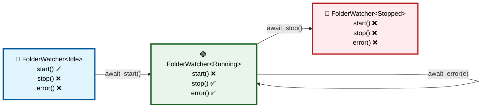

# 🤓 Urkel
**"Did I do that?" — Never ask that about your state transitions again.**

Urkel is a lightweight Domain-Specific Language (DSL) and compiler for generating mathematically sound, **compile-time safe** Finite State Machines (FSMs) in Swift. State Machines are defined in a human-readable text format.

By utilizing the **Typestate Design Pattern** and Swift's modern `~Copyable` (noncopyable) and `~Escapable`(nonescapable) types, Urkel ensures that invalid state transitions are entirely unrepresentable in your code. If an event isn't valid for the current state, your app simply will not compile. You will always be able to call the right function at the right time.

---

## 🛑 The Problem: Runtime State Chaos
State management in Swift is notoriously tricky, especially when concurrency gets involved. When you use standard enums and booleans to track state, the compiler has no idea what your domain logic actually is.

**The Car Problem:** If you are building a driving simulator, the compiler will happily let you call `car.accelerate()` even if the car's state is currently `EngineOff` or `StoppedAtRedLight`. 

To prevent this, you end up writing endless `guard` statements, throwing runtime errors, and trying to track down race conditions.

## ✅ The Solution: Typestate & Isolation
Urkel fixes this by shifting state validation to the **compiler level**. 

By encoding the state into the type signature itself, Urkel guarantees linear progression. Furthermore, by leaning heavily on `~Copyable` and strict boundaries, Urkel provides **phenomenal concurrency isolation**. Because states are explicitly consumed and passed forward, you don't have to sprinkle `@Sendable` everywhere to appease the Swift 6 strict concurrency checker.

### 1. Write your `.urkel` definition
Urkel syntax is simple, readable, and relies on a **Bring Your Own Types (BYOT)** philosophy. Here is a real-world example of a File System Watcher:

```text
# FolderWatch.urkel
machine FolderWatch<FolderWatchContext>
@compose Indexer
@factory makeObserver(directory: URL, debounceMs: Int)

@states
  init Idle
  state Running
  final Stopped

@transitions
  # [Current]   -> [Trigger(Payload)]   -> [Next]
  Idle         -> start                  -> Running => Indexer.init
  Running      -> stop                   -> Stopped
```

### 2. Urkel Generates the Typestate Interface
When you build your project, the Urkel SPM Plugin automatically converts that text into a strictly typed, memory-safe Swift interface.

```swift
// ⚡️ GENERATED CODE (Simplified)
public enum Idle {}
public enum Running {}
public enum Stopped {}

extension FolderWatchObserver where State == Idle {
    // You can ONLY call start() when the state is Idle!
    // 'consuming' destroys the Idle state in memory. You cannot call it twice.
    public consuming func start() async -> FolderWatchObserver<Running> { ... }
}

extension FolderWatchObserver where State == Running {
    // start() is physically impossible to call here. 
    public consuming func stop() async -> FolderWatchObserver<Stopped> { ... }
}
```

### 3. You Implement the Business Logic
Urkel generates the *Interface* and the constraints. You provide the *Implementation*. 
Urkel generates a factory client (perfect for Point-Free's `swift-dependencies`). You simply inject the closures that perform your side effects into your isolated context.

```swift
// YOUR CODE
extension FolderWatchClient: DependencyKey {
    public static var liveValue: Self {
        Self(
            makeObserver: { directory, debounceMs in
                return FolderWatchObserver<Idle>(
                    start: { context in
                        await context.startWatching(directory)
                        return context // Pass the isolated context to the next state
                    },
                    stop: { context in
                        await context.cleanup()
                    }
                )
            }
        )
    }
}
```

### How It All Works Together: The Typestate Pattern

Urkel's magic comes from encoding state in the **type system itself**. Here's how:



**What makes this special:**

| State | Available Methods | Why Others Can't Call Them |
|-------|------------------|---------------------------|
| **Idle** | `start()` | ✅ Type is `FolderWatcher<Idle>` | stop(), error() exist only on `FolderWatcher<Running>`, not `FolderWatcher<Idle>` |
| **Running** | `stop()`, `error()` | ✅ Type is `FolderWatcher<Running>` | The compiler literally won't let you call start() because there's no such method on this type |
| **Stopped** | *(none)* | ✅ Type is `FolderWatcher<Stopped>` | Final state; no transitions available |

**The genius:** When you call `start()`, it **consumes** the `Idle` state and returns a `Running` state. The old state no longer exists. You cannot accidentally call `start()` twice because the first call destroyed the `Idle` instance.

```swift
var watcher = FolderWatcher<Idle>(...)
let running = await watcher.start()    // ✅ OK: Idle → Running

await watcher.stop()                   // ❌ COMPILE ERROR
// error: use of consumed value 'watcher'
// The Idle instance was consumed by start()

await running.stop()                   // ✅ OK: Running → Stopped
let stopped = await running.stop()
```

---

## ✨ Key Features

* **Zero Invalid States:** By encoding states as generic type parameters (`Observer<State>`), illegal transitions result in Xcode build errors, not runtime crashes.
* **Memory Safety & Linear Progression:** Leverages Swift 5.9+ `~Copyable` and `~Escapable` types. When you transition from `A` to `B`, state `A` is `consuming`. You physically cannot accidentally reuse an old state or create duplicated state branches.
* **Painless Swift 6 Concurrency:** By enforcing strict architectural boundaries and state consumption, Urkel isolates side effects perfectly. It makes complex async workflows completely thread-safe without drowning your codebase in `@Sendable` requirements.
* **Bring Your Own Types (BYOT):** Urkel doesn't force you into a proprietary type system. Pass your existing Swift structs, classes, or actors as transition payloads.
* **Magical Tooling:** Includes an SPM `BuildToolPlugin`. Just drop `.urkel` files into your Xcode project, hit `Cmd + B`, and the code generates automatically in the background.

### Implementation Status Matrix

Not all features are equally mature. Here's what's ready to use now vs. what's coming:

| Feature | Status | Swift Version | Notes |
|---------|--------|---------------|-------|
| **Type-safe FSM with state encoding** | ✅ Stable | 5.9+ | Core feature; all machines use `Machine<State>` |
| **Noncopyable types (~Copyable)** | ✅ Stable | 5.9+ | All generated machines are noncopyable; prevents state duplication |
| **Move semantics (consuming)** | ✅ Stable | 5.9+ | All transitions use `consuming func`; old state is destroyed |
| **@Sendable closures** | ✅ Stable | 5.1+ | All transition closures are `@Sendable`; Swift 6 ready |
| **Typestate Pattern** | ✅ Stable | 5.9+ | Encode state in type parameters; impossible to call wrong transition |
| **Bring Your Own Types (BYOT)** | ✅ Stable | 5.9+ | Use your own domain types; Urkel doesn't force a framework |
| **SPM Build Tool Plugin** | ✅ Stable | 5.9+ | Generates code automatically during `swift build` |
| **Command Plugin (checked-in gen)** | ✅ Stable | 5.9+ | Write generated files directly to repo |
| **@compose (sub-machines)** | 🟡 Works | 5.9+ | Can reference composed machines; limited to pass-through currently |
| **@continuation (accessors)** | 🟡 Works | 5.9+ | Read-only properties like `var events: Stream` |
| **Mustache Templates** | 🟡 Works | — | Custom Kotlin or bring your own templates |
| **Noncopyable (~Escapable)** | 🟡 Partial | 5.9+ | Context-threaded mode only (not default) |
| **Fork operator & orchestration** | 📋 Planned | TBD | Epic 11; manage lifecycle of multiple sub-FSMs |
| **SE-0432 (noncopyable switch)** | 📋 Prepared | 6.0+ | Design compatible; adoption pending |
| **SE-0430 (transferring)** | 📋 Prepared | 6.0+ | Move semantics prepared; explicit adoption pending |

**Legend:** ✅ = Fully working and stable | 🟡 = Works with limitations | 📋 = Planned, not yet available

---

## 🎯 Why Each Technique Matters

Urkel's power comes from combining several advanced Swift features. Here's why each one is essential:

### ~Copyable (Noncopyable Types)

Normally, Swift structs can be copied. But with Urkel FSMs, there should be only *one* legal state at any time. Making machines `~Copyable` prevents accidental duplication.

```swift
var idle = Machine<Idle>(...)
let running = await idle.start()  // idle is consumed here!
// idle no longer exists; you cannot accidentally call start() again
```

Without noncopyability, you could do:
```swift
var idle = Machine<Idle>(...)
let copy = idle  // ❌ Wrong! Now you have two copies of the same state
```

**Impact:** Eliminates entire classes of concurrency bugs at compile time.

### consuming (Move Semantics)

When you call `consuming func start() -> Machine<Running>`, the Idle machine is **explicitly moved** into the function and destroyed. You cannot reuse it.

```swift
consuming func start() async -> Machine<Running> {
    // old self is consumed and destroyed
    // you must return a new Machine<Running>
}
```

The compiler enforces this. You will get a "consumed" error if you try to use the old state.

**Impact:** Forces linear progression through states. No branching, no duplication.

### @Sendable Closures

Every transition is an `@Sendable` closure. This means it can safely cross async/await boundaries without needing `@MainActor` annotations.

```swift
fileprivate let _startTransition: @Sendable () async -> Machine<Running>
```

The compiler verifies that each closure captures only thread-safe types. This gives you strict concurrency compliance automatically.

**Impact:** Swift 6 compatibility out of the box. No `@MainActor` sprawl needed.

### Typestate Pattern

Instead of checking state at runtime with guard statements, Urkel encodes state in the type itself:

```swift
extension Machine where State == Idle {
    // Only start() exists here
    public consuming func start() async -> Machine<Running> { ... }
}

extension Machine where State == Running {
    // Only stop() exists here
    public consuming func stop() async -> Machine<Stopped> { ... }
}
```

If you try to call `stop()` on a Machine<Idle>, the code won't compile—there is no such method.

**Impact:** Impossible to call the wrong transition. The type system is your enforcer.

### Generic Machine<State>

By making the machine generic over State, Urkel puts all type information in one place. State markers (`enum Idle {}`) are phantom types—they carry no runtime data, just compile-time type information. This is zero-overhead.

**Impact:** Type safety without performance cost.

### BYOT (Bring Your Own Types)

Your context, your payload types, your domain logic—Urkel generates only the state machine interface. You're not locked into a framework.

**Impact:** Urkel integrates seamlessly with your existing codebase. Your types, your rules.

---

## 🏆 Design Intelligence: Why This Approach Is Exceptional

### The Three Pillars of Safety

Most FSM libraries solve one or two of these problems. Urkel solves all three simultaneously:

1. **Type-Level Safety** — Illegal transitions are unrepresentable (not just disallowed; literally impossible to write)
2. **Memory Safety** — State cannot be duplicated—only moved. No shared references means no race conditions
3. **Concurrency Safety** — All transitions are `@Sendable`, so you don't need `@MainActor` or manual thread-safety annotations

### Comparison to Alternatives

| Approach | Type Safety | Memory Safety | Concurrency Safety | Learning Curve | Overhead |
|----------|-------------|---------------|-------------------|-----------------|----------|
| Enum-based FSM | ⚠️ (guard statements) | ❌ (shared state) | ❌ (locks needed) | 🟢 Familiar | ✅ None |
| Redux/MVVM | ⚠️ (loose) | ❌ (shared store) | ⚠️ (race conditions possible) | 🟢 Familiar | ⚠️ Overhead |
| Manual Actor Isolation | ❌ (requires discipline) | ✅ (actor isolation) | ✅ (actor ensures exclusion) | 🔴 Complex | ⚠️ Overhead |
| **Urkel** | ✅ (type system) | ✅ (noncopyable) | ✅ (@Sendable) | ⚠️ (5.9+ features) | ✅ Zero |

### Why This Matters in Real Code

**Traditional enum-based FSM (vulnerable to races):**
```swift
var state: State = .idle
func start() async {
    guard state == .idle else { return }
    state = .running  // ⚠️ Another task could modify state here
    await doWork()
    state = .stopped
}
```

**Urkel FSM (impossible to race):**
```swift
var machine = Machine<Idle>(...)
let running = await machine.start()  // machine is consumed
let stopped = await running.stop()   // running is consumed
// If you never call stop(), the compiler warns you about unused value
```

The Urkel version is mathematically guaranteed to be correct. No locks, no actors, no discipline required.

---

## ⚠️ Design Limitations (And Why They Exist)

### Can't Have Optional Transitions

```swift
// ❌ Not possible:
Idle -> maybe_start -> Running
```

**Why:** The whole point is that you either *can* or *cannot* make a transition. There's no "maybe—it depends on runtime data." If the transition depends on data, that data is the event payload.

**Workaround:** Pass the decision as event data:
```
Idle -> start(condition: Bool) -> Running
```

### Can't Ignore a State Machine After Creation

```swift
let machine = Machine<Idle>(...)
// ❌ If you don't call a transition, the compiler warns about unused value
// ✅ You must explicitly handle it: let _ = machine (to silence warning)
```

**Why:** The compiler takes state seriously. If you start a file watcher but never call `stop()`, you should feel uncomfortable about that.

### Composition Is Currently Limited

You can declare `@compose Indexer`, but you don't yet have full control over the Indexer's lifecycle from within the parent machine. The fork operator and orchestration features (Epic 11) will enable this.

**Status:** This is actively being worked on. For now, use factory closures to pass pre-initialized sub-machines.

### Two Different Generation Modes

Urkel supports two architectural patterns, and you must choose one per machine:

- **Closure-captured** (default): Transitions are pure functions; side effects captured in closures
- **Context-threaded**: Transitions receive and return a shared context

You can't easily mix them in one machine.

**Workaround:** Use the mode that fits your architecture. See "Understanding Generation Modes" in the documentation.

---

## 🔄 Quick Comparison: When to Use Urkel

### Urkel vs Enum-based FSMs

**Use Urkel if:**
- You need compile-time state validation
- You're managing complex concurrent workflows
- You want zero runtime type checks
- Your state machine will grow beyond 3-4 states

**Use Enum if:**
- Your state machine is trivial (on/off, a few states)
- Your team is unfamiliar with Swift 5.9+ features
- Simplicity matters more than safety

### Urkel vs Redux/MVVM

**Use Urkel if:**
- You're building a state machine (linear progression required)
- Concurrency safety is critical
- You want to avoid global state

**Use Redux if:**
- You're managing app-wide state
- You have many independent pieces of state
- You need time-travel debugging

### Urkel vs Manual Actor Isolation

**Use Urkel if:**
- You want compile-time guarantees
- You prefer immutability and move semantics
- Readability and tooling matter

**Use Manual Actors if:**
- You need mutable shared state
- Your concurrency model doesn't fit a state machine
- You want simplicity over type safety

---

## 📖 Enhanced Example: What Happens When You Make a Mistake

The power of Urkel comes from what happens when you write code incorrectly.

### ✅ Correct Usage

```swift
// Create an observer in the Idle state
var observer = FolderWatchObserver<Idle>(
    directory: URL(...),
    debounceMs: 500,
    startTransition: { /* ... */ }
)

// Call start() — it exists on Idle, so the code compiles
let running = await observer.start()

// start() consumed the Idle observer, so you can't use it anymore
// observer is no longer accessible here

// Now running is in the Running state
// Call stop() — it exists on Running
let stopped = await running.stop()

// running is consumed; you now have stopped
```

### ❌ Wrong: Calling the Wrong Transition

```swift
var observer = FolderWatchObserver<Idle>(/* ... */)
await observer.stop()  // ❌ COMPILE ERROR
// error: value of type 'FolderWatchObserver<Idle>' has no member 'stop'
```

This error happens **at compile time**, not at 3 AM in production. The type system physically prevents the error from existing.

### ❌ Wrong: Reusing a Consumed State

```swift
var observer = FolderWatchObserver<Idle>(/* ... */)
let running = await observer.start()

// ❌ Try to reuse the old Idle observer
await observer.stop()
// error: use of consumed value 'observer'
```

The `consuming` keyword means the old state is destroyed. You cannot accidentally reuse it.

### ❌ Wrong: Forgetting a Transition

```swift
var observer = FolderWatchObserver<Idle>(/* ... */)
let running = await observer.start()

// ❌ Never call stop() — the compiler warns:
// warning: variable 'running' was never used
```

Because states are noncopyable, the compiler tracks their lifetime. If you create a state and never transition out of it, you get a warning. This helps catch bugs where you forgot to clean up.

### Why This Matters

Every mistake above is **impossible** in traditional enum-based FSMs without runtime checks. Urkel catches them at compile time, when they're free to fix.

---

## 🧩 Understanding Generation Modes

Urkel generates code differently depending on your `.urkel` file. Here's how to know which mode you're in:

### Closure-Captured Mode (Default)

**Use this if you don't have** `@context` **or** `@compose` **in your machine:**

```text
machine FolderWatch
@factory makeObserver(directory: URL, debounceMs: Int)

@states
  init Idle
  state Running
  final Stopped

@transitions
  Idle -> start -> Running
  Running -> stop -> Stopped
```

**In this mode:**
- Transitions are pure functions with no explicit context
- Side effects are captured in the closures you provide
- Simpler to use for straightforward FSMs
- Default mode

**Example usage:**
```swift
let observer = FolderWatchObserver<Idle>(
    directory: url,
    debounceMs: 500,
    startTransition: {
        // Your logic here; captured by closure
        return FolderWatchObserver<Running>(/* ... */)
    }
)
```

### Context-Threaded Mode

**Use this if you have** `machine Name<ContextType>` **or** `@compose` **declarations:**

```text
machine FolderWatch<FolderWatchContext>
@compose Indexer
@factory makeObserver(directory: URL, debounceMs: Int)

@states
  init Idle
  state Running
  final Stopped

@transitions
  Idle -> start -> Running => Indexer.init
  Running -> stop -> Stopped
```

**In this mode:**
- Transitions receive the context and return an updated context
- The context flows through the machine
- You can manage shared state across transitions
- Machines support `~Escapable` (nonescapable)

**Example usage:**
```swift
let observer = FolderWatchObserver<Idle>(
    directory: url,
    debounceMs: 500,
    context: FolderWatchContext(...),
    startTransition: { context in
        // Receive context, do work, return updated context
        return context
    }
)
```

**Which should I use?**
Start with **closure-captured** (the default). Only switch to **context-threaded** if you find yourself needing shared state across multiple transitions.

---

## 🤝 Inspiration & Credits

The architectural concepts powering Urkel stand on the shoulders of giants in the Swift community:

* **Typestate Pattern:** The implementation of state-as-types is deeply inspired by Alex Ozun's excellent writings on [Making Illegal States Unrepresentable](https://swiftology.io/articles/making-illegal-states-unrepresentable/) and the [Typestate Pattern in Swift](https://swiftology.io/articles/typestate/).
* **Concurrency & Isolation:** The approach to actor isolation, dependency injection, and safely crossing async boundaries without overusing `Sendable` is heavily inspired by the brilliant folks at [Point-Free](https://www.pointfree.co/) and Matt Massicotte's definitive [Intro to Isolation](https://www.massicotte.org/intro-to-isolation/).

---

## 🚀 Getting Started

### 1. Installation (Swift Package Manager)
Add Urkel to your `Package.swift` dependencies:
```swift
dependencies: [
    .package(url: "https://github.com/mackoj/urkel.git", from: "1.0.0")
]
```
If you want generated files to appear in DerivedData during a normal build, add the build tool plugin to your target:
```swift
.target(
    name: "MyApp",
    plugins: [
        .plugin(name: "UrkelPlugin", package: "urkel")
    ]
)
```
The plugin runs automatically when Xcode or SwiftPM builds the target, so there is no separate “run plugin” button. It resolves the `UrkelCLI` executable tool under the hood and writes generated files into the plugin work directory.

If you want the generated file checked into your package and committed to source control, run the command plugin instead:

```bash
swift package plugin --allow-writing-to-package-directory urkel-generate
```

That command writes directly into the package directory, so it can update a file like `Sources/FolderWatch/FolderWatchClient+Generated.swift`.

Both plugins read the same package-local `urkel-config.json` style files. The only difference is where the generated output lands: the build tool plugin uses DerivedData, while the command plugin can write back into the repository.

### 2. Create your first Machine
Add a file named `Machine.urkel` anywhere in your target's source folder. The plugin will automatically detect it, compile it, and make the Typestate boilerplate available to your Swift code immediately.

### 2.1 Configure the plugin (Optional)
If you want to change where generated files go or export to another language/template, add a `.urkel-config.json` file next to your `.urkel` source files or any parent directory:

```json
{
  "imports": {
    "swift": ["Foundation", "Dependencies"],
    "kotlin": ["kotlin.collections", "kotlin.io"]
  },
  "outputFile": "ConfiguredFolderWatch.swift",
  "template": "Templates/machine.mustache",
  "outputExtension": "kt",
  "sourceExtensions": ["urkel"]
}
```

Supported keys:

* `outputFile`: output path relative to the current generator root. In build-tool mode that root is the plugin work directory; in command-plugin mode it is the package directory.
* `template`: path to a custom Mustache template, resolved relative to the config file.
* `language`: bundled language template name, currently `kotlin`.
* `imports`: per-language import map (for example `imports.swift` and `imports.kotlin`).
* `outputExtension`: overrides the generated file extension.
* `sourceExtensions`: source file extensions the plugin should process, defaulting to `["urkel"]`.

Legacy config keys `swiftImports` and `templateImports` are no longer supported. Use `imports.swift` and `imports.<language>` instead.

For troubleshooting, CLI and watch mode can print the effective resolved config with `--print-effective-config`.

### 3. CLI Usage (Optional)
If you prefer manual generation or want to watch a directory during development outside of Xcode:
```bash
# Generate Swift files once
swift run UrkelCLI generate ./Sources --output ./Generated

# Watch a directory and regenerate live on file save
swift run UrkelCLI watch ./Sources --output ./Generated
```

### 4. Generation Architecture (for contributors)

Urkel parses `.urkel` files once into `MachineAST`, then emits code through one of two paths:

* `SwiftCodeEmitter` for native Swift generation
* `TemplateCodeEmitter` for template-based generation (`--template` and `--lang kotlin`)

Kotlin currently uses the template emitter with the bundled `kotlin.mustache` template.

For deeper internals (CLI/plugins/watch/LSP, module map, and diagrams), see:

* `Sources/Urkel/Urkel.docc/Codebase-Architecture.md`

### 5. User Stories and Roadmap

Urkel implementation decisions and roadmap are tracked as user stories in:

* `User Stories/README.md`

Stories are grouped by epic and include objective, acceptance criteria, implementation notes, and test strategy.

### 6. Grammar Reference

The formal language grammar is versioned at repository root:

* `grammar.ebnf`

For narrative documentation of the same grammar and language rules, see:

* `Sources/Urkel/Urkel.docc/Language-Spec.md`
