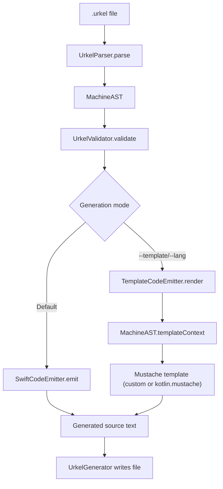
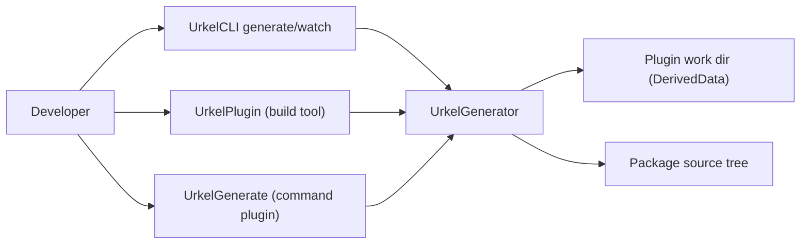

# Urkel Codebase Architecture

This page explains how Urkel is organized internally, how `.urkel` input flows through the system, and where to add new capabilities.

## High-level modules

- **Core model and parsing**
  - `MachineAST.swift`
  - `UrkelParser.swift`
  - `UrkelValidator.swift`
- **Code generation**
  - `SwiftCodeEmitter.swift` (native Swift output)
  - `TemplateCodeEmitter.swift` (template-based output, including Kotlin)
  - `MachineAST+TemplateContext.swift` (template payload shaping)
  - `Templates/kotlin.mustache`
- **Orchestration**
  - `UrkelGenerator.swift` (parse/validate/emit/write pipeline)
  - `UrkelWatchService.swift` (directory polling + incremental regeneration)
- **Developer interfaces**
  - `Sources/UrkelCLI/UrkelCLI.swift` (`generate`, `watch`)
  - `Plugins/UrkelPlugin/UrkelPlugin.swift` (build-tool plugin, DerivedData outputs)
  - `Plugins/UrkelGenerate/UrkelGenerate.swift` (command plugin, package write-back)
  - `UrkelLanguageServer.swift` + `Sources/UrkelLSP/main.swift` (LSP support)

## End-to-end generation flow

## `UrkelGenerator` responsibilities

`UrkelGenerator` is the central coordinator:

1. Loads source file contents.
2. Parses to `MachineAST`.
3. Applies fallback machine naming when needed.
4. Validates semantics (`initial` state count, state references).
5. Selects emitter path:
   - Swift path: `SwiftCodeEmitter`
   - Template path: `TemplateCodeEmitter`
6. Resolves output path/extension and writes generated file.

## Emitters: clear separation

### `SwiftCodeEmitter`

Purpose: generate rich, typed Swift runtime code from `MachineAST`.

Produces:

- typestate namespace (`MachineNameMachine`)
- typed observer (`MachineNameObserver<State>`)
- transition extensions with `consuming` methods
- combined state wrapper (`MachineNameState`)
- runtime helpers (`RuntimeContext` bridge, runtime stream helper, runtime builder)
- dependency client wiring (`DependencyKey`, `DependencyValues` accessor)

### `TemplateCodeEmitter`

Purpose: render foreign-language output from templates.

Inputs:

- `MachineAST`
- template string (custom template or bundled language template)

Data contract:

- `MachineAST.templateContext` contains keys consumed by templates:
  - `machineName`, `contextType`, `imports`, `states`, `transitions`, `initialState`, `factory`

Kotlin currently uses this path via bundled `Templates/kotlin.mustache`.

## CLI, plugins, and watch mode

- Build-tool plugin writes to plugin work directory (DerivedData).
- Command plugin can write generated files into the package directory.
- `UrkelWatchService` repeatedly snapshots `.urkel` files and re-invokes generation on changes.

## LSP architecture

`UrkelLanguageServer` reuses parser/validator and exposes editor features:

- diagnostics (parse + semantic validation)
- completion
- hover
- formatting (`UrkelParser.print`)
- code actions
- semantic tokens

Transport and JSON-RPC wiring lives in `Sources/UrkelLSP/main.swift`.

## Where to make changes

- **Grammar changes**: `UrkelParser.swift`, `MachineAST.swift`, validator updates, parser tests.
- **Swift runtime output changes**: `SwiftCodeEmitter.swift`, emitter/snapshot tests.
- **Template output changes (Kotlin/custom)**: `MachineAST+TemplateContext.swift`, `TemplateCodeEmitter.swift`, template files/tests.
- **CLI/plugin behavior**: `UrkelCLI.swift`, plugin files, integration tests.
- **Editor tooling**: `UrkelLanguageServer.swift` and LSP entrypoint.

## Backward-compatibility notes

For migration safety, these aliases are retained:

- `UrkelEmitter` -> `SwiftCodeEmitter`
- `MustacheExportEngine` -> `TemplateCodeEmitter`
- `dictionaryRepresentation` -> `templateContext`

New code should prefer the new names.
