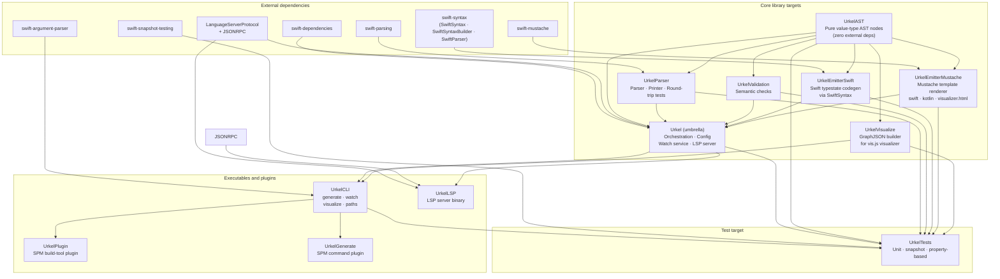
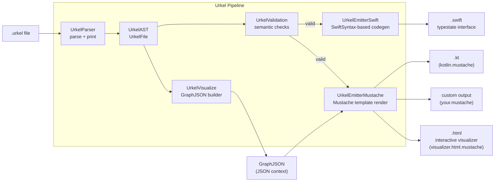
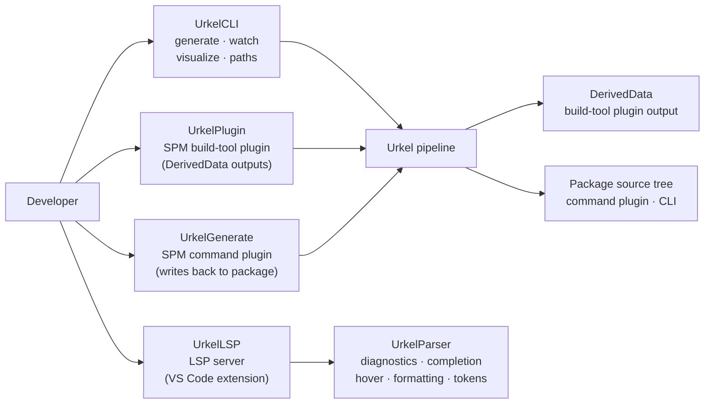

# Package Architecture

A complete map of Urkel v2's Swift package — modules, dependencies, pipelines, and developer entry points.

## Module dependency graph

Each library target is independently importable. The dependency graph is strictly acyclic and layered by abstraction level.

## End-to-end generation pipeline

The rule is simple:

| Target output | Emitter |
|---|---|
| Swift (compiled typestate code) | `UrkelEmitterSwift` via SwiftSyntax |
| Everything else (Kotlin, HTML, custom) | `UrkelEmitterMustache` via a `.mustache` template |

Adding a new output language only requires dropping a new `.mustache` file into `Sources/UrkelEmitterMustache/Templates/` — no Swift code changes needed.

## Developer entry points

- **`UrkelPlugin`** is a build-tool plugin — it writes generated files to the plugin work directory inside DerivedData. Files are recompiled on every build but never checked in.
- **`UrkelGenerate`** is a command plugin — it writes generated files directly into the package source tree. Run once; check the result in to version control.
- **`UrkelCLI`** exposes `generate`, `watch`, `visualize`, and `paths` subcommands for use outside of Xcode or SPM.
- **`UrkelLSP`** is a standalone LSP server binary consumed by the `urkel-vscode-lang` VS Code extension.

## Bundled Mustache templates

| Template file | Triggered by | Output |
|---|---|---|
| `swift.mustache` | `--lang swift` (template mode) | Swift source (alternative to emitter) |
| `kotlin.mustache` | `--lang kotlin` | Kotlin source |
| `visualizer.html.mustache` | `urkel visualize` CLI command | Self-contained HTML+JS visualizer |

## Where to make changes

| Change type | Files to touch |
|---|---|
| Grammar / syntax | `userstories/grammar.ebnf`, `Sources/UrkelParser/UrkelFileParser.swift`, `Tests/UrkelTests/ParserPropertyTests.swift` |
| AST node types | `Sources/UrkelAST/`, `UrkelParser`, `UrkelValidation`, emitters |
| Swift typestate output | `Sources/UrkelEmitterSwift/` |
| Mustache template output | `Sources/UrkelEmitterMustache/Templates/*.mustache` |
| HTML visualizer appearance | `Sources/UrkelEmitterMustache/Templates/visualizer.html.mustache` (no recompile needed) |
| Graph data (nodes/edges) | `Sources/UrkelVisualize/GraphJSON.swift` |
| CLI commands | `Sources/UrkelCLI/UrkelCLI.swift` |
| Semantic validation rules | `Sources/UrkelValidation/` |
| LSP / editor features | `Sources/UrkelLSP/`, `Sources/Urkel/UrkelLanguageServer.swift` |
